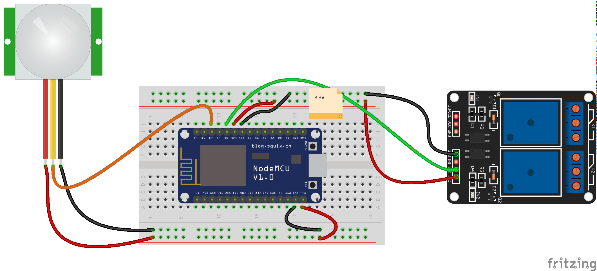

# Alarma

Usaremos un sensor PIR para detectar la presencia y activar un relé

Los sensores PIR detecte los cambios en la radiación infrarroja que emiten los seres vivos

## Montaje

## Código

        #define Sensor_PIR D2
        #define Rele_1 D4

        void setup()
        {
          pinMode(Sensor_PIR, INPUT);  // Activamos el sensor PIR como entrada
          pinMode(Rele_1, OUTPUT);     // Activamos la salida del rele

        }

        void loop()
        {
           if( digitalRead(Sensor_PIR) == HIGH ) {  // Si se activa el sensor PIR
            digitalWrite(Rele_1,HIGH);
           } else {
            digitalWrite(Rele_1,LOW);
           }

        }
