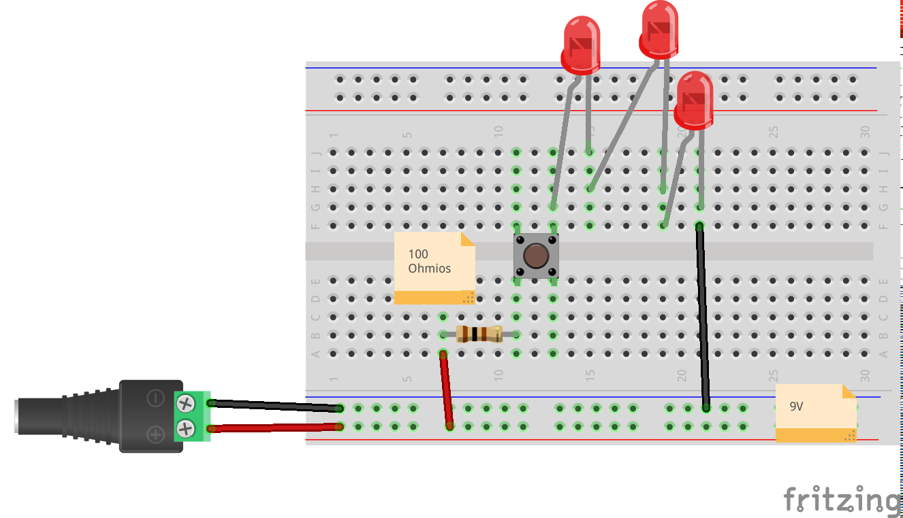
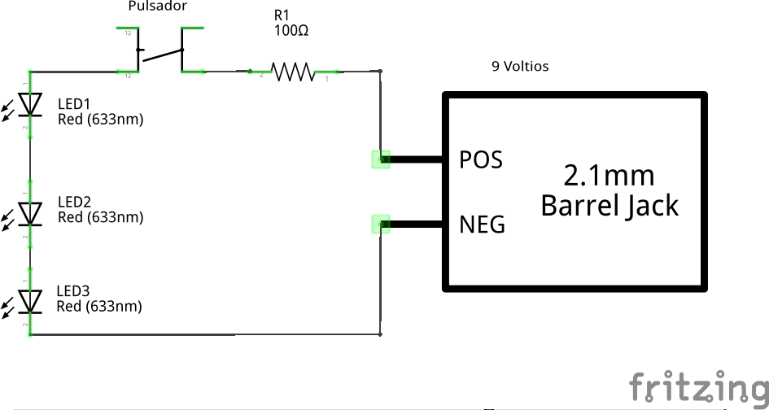

1. Electricidad
  1. Tipos de corrientes
  1. Polaridad
  1. Circuitos
  1. Continuidad
1. Componentes
  1. Leds
  1. Resistencias
  1. Pulsadores e interruptores
1. Montajes sencillos
  1. Circuito básico
  1. Montaje serie
  1. Montaje paralelo
1. Cálculo en circuitos
  1. Ley de Ohm
  1. Ley de ¿Kirchoff?
  1. Cálculo

ENLACES A PRESENTACIONES

  
