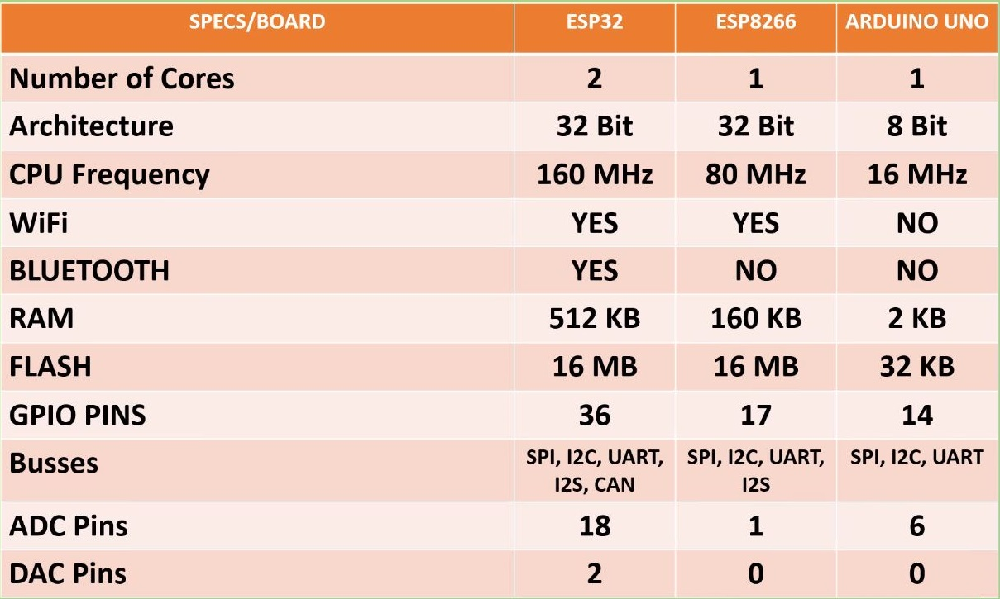

## Uso IDE de Arduino

Usaremos el paquete instalado para Guadalinfo "Arduino IDE 1.8"

En [este enlace](./ConfiguracionIDE.md) podemos ver cómo se instalaría desde cero a partir del IDE de Arduino

## Diferencias con Arduino

1. Diferente capacidad

2. Programa más pequeño (diferencia microcontrolador/SOC: Sistem On Chip)

## Funcionamiento
1. Proceso de compilación
1. Las placas tienen un único programa

##  Uso del IDE

1. Cargamos un ejemplo Archivo -> Ejemplos
1. Seleccionamos (o comprobamos) que está seleccionada la placa NodeMCU 1.0 Herramientas -> Placa -> NodeMCU 1.0

1. Pulsamos Validar/Compilar
1. Si se produce un error  revisamos según el esquema…

1. Seleccionamos el puerto al que está conectado Herramientas -> Puerto -> ttyUSB

  

1. Seleccionamos Herramientas -> Velocidad de transmisión -> 921600

    

1. Subimos el programa a la placa   El led ázul de la placa parpadeará

Se puede producir un error si no hemos seleccionado bien el puerto USB en el paso anterior
    
