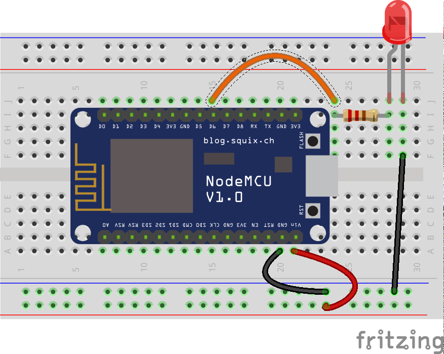

# Iluminacion gradual

Vamos a controlar la intensidad de iluminación usando una técnica que se llama PWM

Hacemos el cambio de esta 1000 veces por segundo (Frecuencia PWM)
Cuanto mayor sea el % de tiempo que la señal esté en estado algo mayor será la potencia que se trasmite. Es lo que se conoce como el ciclo de carga (Duty cicle)

Podemos usar cualquiera de estos pines para generar una señal PWM

Podemos establecer el nivel PWM con la instrucción __analogWrite__

    analogWrite(D6,valorPWM);

 Siendo 1023 el valor para 100% (y 0 para 0%)

Con esta técnica podemos controlar la potencia que se transmite a un led o a un motor, pero no a un relé (porque el relé no es capaz de encenderse tantas veces por segundo)

También podemos cambiar la frecuencia del PWM usando __analogWriteFreq__ pudiendo ser esta desde 1Hz hasta 1000KHz

## Montaje

## Código

        #define LED_PWM D6

        int iUmbralHumedad = 500;
        void setup()  {
         
        }

        void loop() {
           for (int i = 0 ; i < 1023 ; i++){ // vamos subiendo el nivel de brillo
              analogWrite(LED_PWM,i);
              delay(100); // damos un tiempo para que se vea el cambio
           }

           for (int i = 1023;i >= 0; i++){  // vamos bajando el nivel de brillo
              analogWrite(LED_PWM,i);
              delay(100); // damos un tiempo para que se vea el cambio
           }

        }

