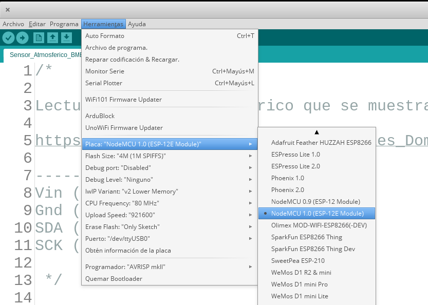
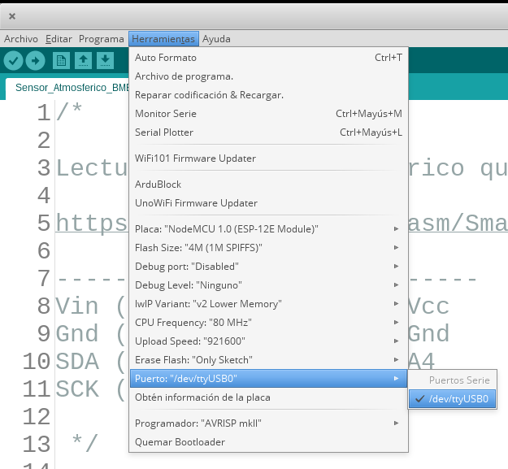
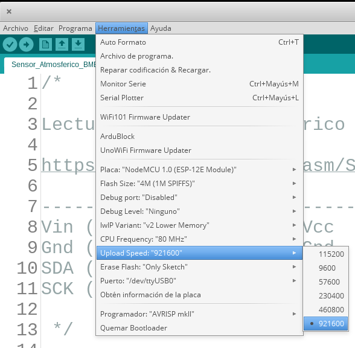
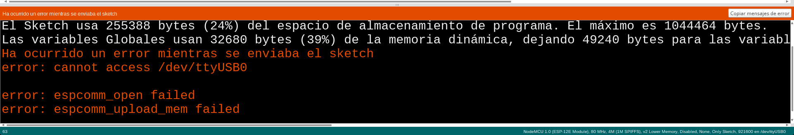

## Leds

Vamos a empezar usando los leds que tiene incluidas las placas.

### Blink o parpadeo

Para ello cargaremos el ejemplo Blink

**Archivo -> Ejemplos -> 01.Basics -> Blink**

##  Uso del IDE

1. Cargamos un ejemplo Archivo -> Ejemplos
1. Seleccionamos (o comprobamos) que está seleccionada la placa NodeMCU 1.0 Herramientas -> Placa -> NodeMCU 1.0

1. Seleccionamos el puerto al que está conectado Herramientas -> Puerto -> ttyUSB

  

1. Seleccionamos Herramientas -> Velocidad de transmisión -> 921600

    

1. Subimos el programa a la placa, El led ázul de la placa parpadeará

  Se puede producir un error si no hemos seleccionado bien el puerto USB en el paso anterior

  

1. Una vez subido empezará a parpadear un led azul de la placa

TODO: Explicar código y cambios posibles

### Haciendo parpadear 2 leds

1. Leds integrados: D0 y D4
  * D0 es el led más cercano al USB y D4 el que está montado más cerca de la antena

  * Cargamos el ejemplo Test_Leds **Archivo -> Ejemplos -> Talleres Tecnología AILs -> 1.Leds -> Test_Leds**
  * Veremos que comienzan a parpadear los 2 leds incluidos en la placa

1. Leds externos, conexión con resistencias. Vamos a añadir ahora un led externo siguiendo el montaje

  

### Ejercicios

1. Añadir un segundo led externo con su correspondiente resistencia conectado a D4
1. Hacer diferentes secuencias de encendido con los diferentes leds
