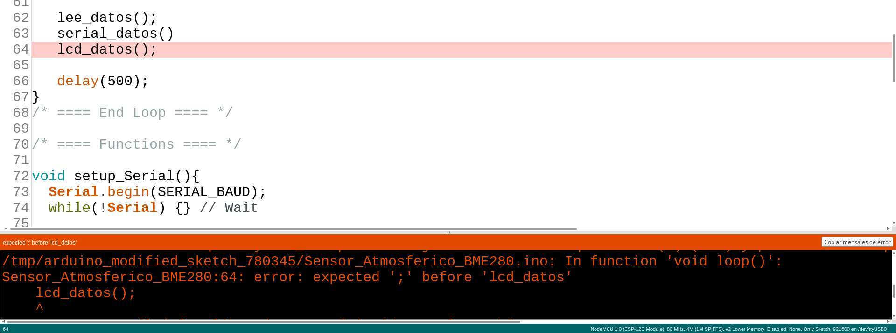

## Programacion Node

1. [Instalación](./ConfiguracionIDE.md)
1. Verificación/Compilación

1. Antes de subir a la placa, configuramos en el menú Herramientas
  1. Placa -> NodeMCU 1.0
  

  2. Puerto -> ttyUSB

    

  3. Velocidad de transmisión

    
  4. Error al subir

    

[Referencia](
https://www.luisllamas.es/esp8266-nodemcu/)
