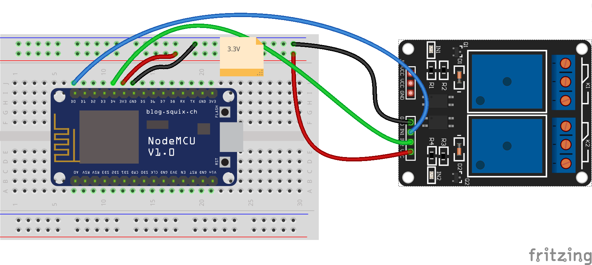

## Relés

1. ¿Qué es un relé?
1. Uso:  control de dispositivos que necesitan más potencia y/o que funcionan a mayores voltajes
1. Control: para activar/desactivar los relés sólo tenemos que activar/desactivar el pin al que está conectado
1. Alimentación y Consumo el control de relés requiere de una mayor potencia de la que puede suministrar el puerto USB, por lo que usaremos un transformador
1. Conexión de los dispositivos a controlar. 
  1. 3 leds + resistencia

### Montaje

### Programación

