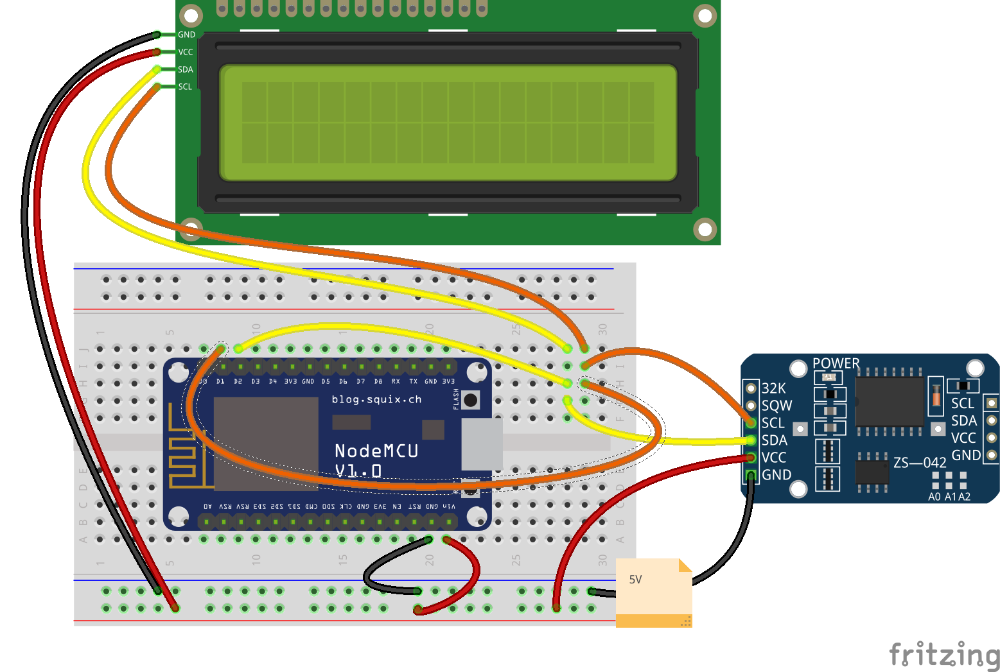

# Reloj RTC DS3231

Usaremos un Reloj de Tiempo Real (RTC), concreto un modelo DS3231 que utiliza protocolo I2C y el LCD

El código está en

**Archivo -> Ejemplos -> Talleres Tecnología AILs -> LCD -> Reloj_RTC**

## Ejercicio

Hacer un programa que enciende y apaga un relé cada 5 segundos [Solución](./codigo/codigo/Reloj_RTC_alarma/Reloj_RTC_alarma.ino)
