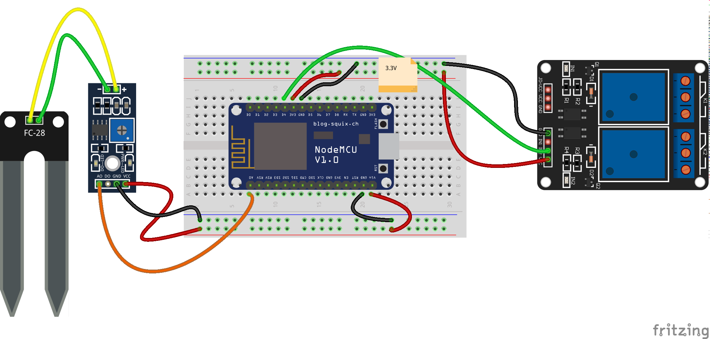

# Riego automático

Medimos la humedad, cuando el valor  es inferior a un umbral establecido (iUmbralHumedad) activamos un relé

## Código

        #define Sensor_Humedad A0
        #define Rele_1 D4

        int iUmbralHumedad = 500;

        void setup()  {
          pinMode(Rele_1, OUTPUT);     // Activamos la salida del rele
        }

        void loop() {
           int valorHumedad = analogRead(Sensor_LDR);
           
           if( valorLDR <= iUmbralHumedad) {  // Si el valor de humedad es menor que el umbral se activa el rele 
            digitalWrite(Rele_1,HIGH);
           } else {
            digitalWrite(Rele_1,LOW);
           }

        }

## Montaje

