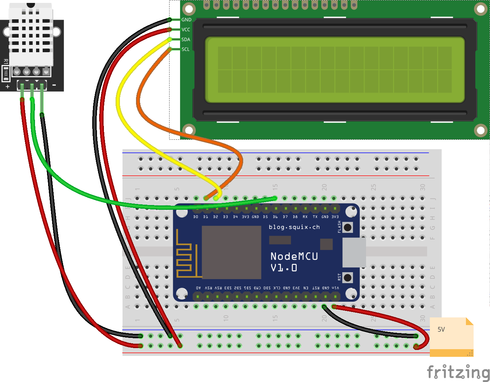
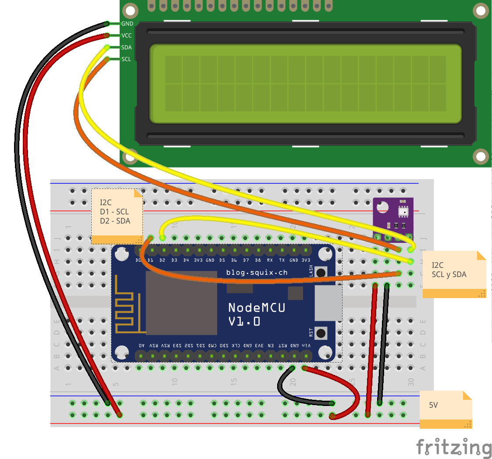

## Sensores atmosfericos

Son sensores capaces de medir los valores de las magnitudes atmosféricas, como la temperatura, humedad, presión, etc.

Veremos los distintos tipos y mostraremos los resultados por el monitor serie y en una pantalla LCD

Si no se ven los valores en el LCD puede ser por un error de conexión del sensor. Abriremos el monitor serie para ver si hay errores del sensor.

### DHT

Es el sensor más barato y puede medir temperatura y humedad ambiental. Tiene una precisión de 1 grado.

Necesitamos un pin digital para cada sensor.

**Archivo -> Ejemplos -> Talleres Tecnología AILs -> 3. Sensores II - LCD - DHT**

### BME280

Es un sensor más preciso (capaz de apreciar las décimas de grado) y que mide temperatura, humedad y presión atmosférica.

Se conectan usando el bus I2C  que comparte con otros dispositivos como el LCD o el reloj RTC

**Archivo -> Ejemplos -> Talleres Tecnología AILs ->3. Sensores II - Sensor Atmosferico BME280**
